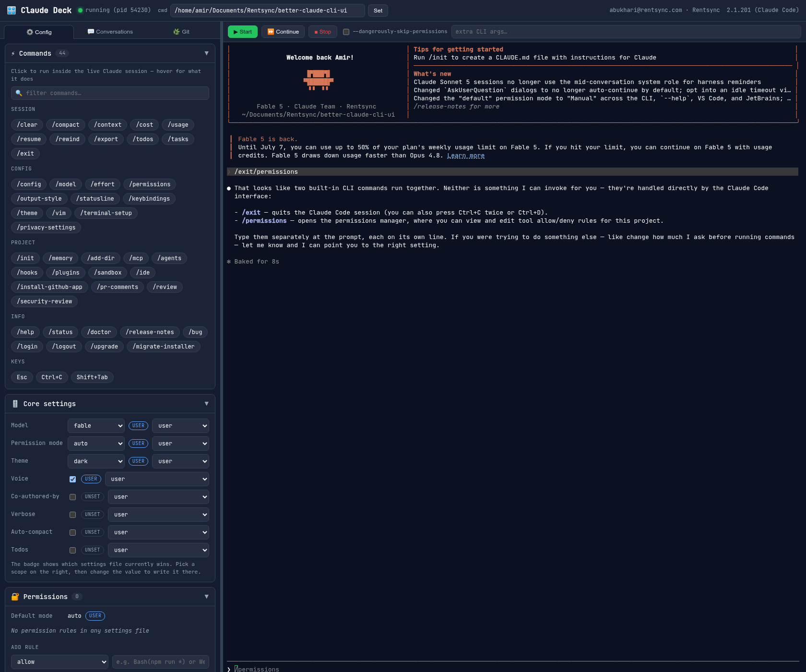

# Claude Deck 🎛️

A two-pane web UI for Claude Code: a **live dashboard** on the left, the **real `claude` CLI** in a terminal on the right. Everything about your Claude setup is visible and clickable.

The left pane has three tabs:

- **⚙️ Config** — the full dashboard (below)
- **💬 Conversations** — every past session in the current project, with readable transcripts and one-click Resume
- **🌿 Git** — branch, remote, working-tree status, and commit history with click-to-view diffs



Design follows the [ui-ux-pro-max](https://github.com/nextlevelbuilder/ui-ux-pro-max-skill) *Developer Tool / IDE* profile: slate-dark palette (#0F172A family), green accent, blue focus rings, JetBrains Mono throughout.

## Run it

```bash
npm install        # see "old GCC" note below if node-pty fails to build
npm start          # http://127.0.0.1:3456
```

Options:

- `PORT=4000 npm start` — different port (binds to 127.0.0.1 only).
- `CLAUDE_UI_CWD=~/some/project npm start` — which directory Claude runs in (defaults to where you launch the server; changeable in the top bar).

## What's in the dashboard

| Section | Shows | Click actions |
|---|---|---|
| Commands | **All ~44 built-in slash commands** grouped by category, plus your custom commands and skills, with a filter box | Click any to run it in the live session (input is cleared first so commands never concatenate); send Esc / Ctrl+C / Shift+Tab |
| Core settings | Model, permission mode, theme, voice, etc. with a badge showing **which settings file wins** | Change any value; pick which scope (user / project / local) to write to |
| Permissions | Every allow/ask/deny rule across all settings files, default mode, additional directories | Add / remove rules per scope |
| MCP servers | Servers from `~/.claude.json`, project `.mcp.json`, and project-local config | Add / remove via `claude mcp` |
| Hooks | All hooks across scopes | (edit via Raw files) |
| Env vars | `settings.env` per scope | Add / remove |
| Agents / Commands / Skills | Everything in `~/.claude/{agents,commands,skills}` and the project's `.claude/` | Click to view & edit the file |
| Memory | `~/.claude/CLAUDE.md`, project `CLAUDE.md` / `CLAUDE.local.md`, keybindings | Click to edit (creates if missing) |
| Conversations tab | Past sessions with summaries and full readable transcripts | Click to read, one-click `--resume <id>` |
| Git tab | Branch, remote, working-tree status, last 60 commits | Click a commit to view its diff |
| Project | Trust status, known projects | Click a project to switch cwd |
| Raw files | Every settings file, with invalid-JSON warnings | Full-file editor; a `.bak` is kept on every save |

The panel is **live**: file watchers on `~/.claude`, `~/.claude.json`, and the project's `.claude/` push updates over a WebSocket, so changes made from inside Claude (e.g. `/config`, `/permissions`) show up in the dashboard immediately, and vice versa.

**Concurrent sessions:** every Start / Continue / Resume opens a new **session tab** — multiple Claude processes run at once, in different projects, and switching tabs never kills anything. Resume from the Conversations tab opens that conversation in a new tab in its own project. The dashboard (config, git, sessions) follows whichever tab is active. Stop / ✕ kill only that tab's session, always with confirmation, and the conversation stays resumable from disk.

Terminal toolbar: Start / Continue (`--continue`) / Stop, a `--dangerously-skip-permissions` toggle, and a free-form extra-args field.

> Settings file edits apply to **new** Claude sessions — open a new tab to pick them up. Commands like `/model` affect the running session directly.

## Accessibility & UX

Audited against ui-ux-pro-max's 99 UX guidelines: full keyboard operability (cards, list rows, deletes, tabs, and the panel divider are all focusable and Enter/Space-operable), ARIA roles/labels/`aria-live` announcements, visible blue focus rings, ≥4.5:1 text contrast, confirmation on destructive actions, disabled-while-pending buttons, empty/loading/no-results states everywhere, `prefers-reduced-motion` support, 44px touch targets on coarse pointers, deep-linkable tabs (`?tab=git`), and non-blocking font loading with `display=swap`.

## Notes

- The server binds to localhost only and whitelists which files the raw file API may touch (settings, `.mcp.json`, `CLAUDE.md`, keybindings, agents/skills/commands dirs).
- **Old GCC (Ubuntu 20.04):** Node ≥20 native addons pass `-std=gnu++20`, which GCC 9 doesn't accept. Build with the included shim:
  ```bash
  CXX=$PWD/tools/g++20-shim npm install
  ```
